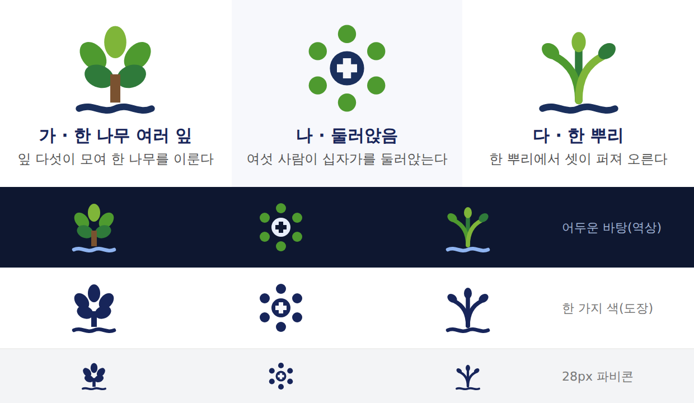

# 동산교회 로고 시안 — 「공동체」 방향

이사야 58:11 물댄동산에서 **공동체**를 골라 그린 심볼 세 가지입니다.
모두 SVG 라 현수막만큼 키워도 깨지지 않습니다.

| 안 | 뜻 |
|---|---|
| **가 · 한 나무 여러 잎** | 잎 다섯이 모여 **한 나무**를 이룬다 |
| **나 · 둘러앉음** | 여섯 사람이 **십자가를 둘러앉는다** |
| **다 · 한 뿌리** | **한 뿌리**에서 셋이 퍼져 오른다 |

## 파일

안마다 세 가지가 있습니다.

- `공동체-○-….svg` — 원안. 밝은 바탕용(홈페이지·주보·현수막)
- `공동체-○-역상.svg` — 어두운 바탕용. 물줄기가 하늘색으로 바뀝니다
- `공동체-○-단색.svg` — 남색 한 가지. 도장·자수·팩스·흑백복사용

## 시험 결과

|  | 28px | 어두운 바탕 | 한 가지 색 | 단색 28px |
|---|---|---|---|---|
| 가 한 나무 여러 잎 | ○ | ○ | △ 잎이 뭉침 | △ 덩어리에 가까움 |
| 나 둘러앉음 | ◎ | ◎ | ◎ | ◎ |
| 다 한 뿌리 | ○ | ○ | ○ | ○ |

**「나」가 가장 튼튼합니다.** 어느 조건에서도 형태가 남고 뜻도 한눈에 읽힙니다.
다만 셋 중 유일하게 **물줄기가 없습니다** — 물댄동산의 「물」이 빠진 셈입니다.

**「가」는 단색 작은 크기에서 약합니다.** 홈페이지 머리처럼 큰 자리에는 좋지만
파비콘·도장에 쓰려면 잎 사이를 더 벌려야 합니다.

**「다」는 균형이 좋습니다.** 물·자라남·공동체 셋을 다 담고 작은 크기도 견딥니다.

## 색

| | 색 |
|---|---|
| 잎 연두 | `#7FB539` |
| 잎 초록 | `#4E9A2F` |
| 잎 진초록 | `#2F7A3A` |
| 줄기 갈색 | `#7A5230` |
| 물·남색 | `#1a2f5c` |
| 글자 남색 | `#17255A` |
| 역상 물색 | `#8FB4F0` |

## 아직 안 한 것

- 한글 워드마크(「동산감리교회」)와 짝지은 가로형·세로형
- 홈페이지 머리·앱 아이콘·파비콘에 실제로 넣기

하나 고르시면 그때 만듭니다.
